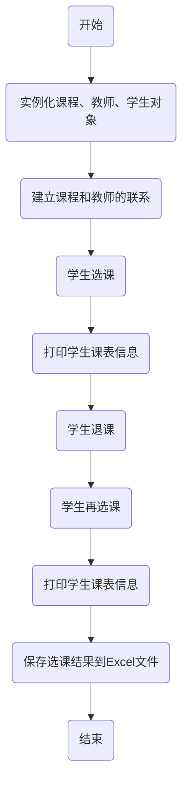

# 实验四 学生选课模拟系统之文件输入输出
## 一、实验目的
1.掌握文件输入输出；
2.了解对象序列化方法。
## 二、业务要求
在实验三（学生选课模拟系统）的基础上，利用文件保存选课结果，实现方法以下三选一：
1.采用自定义格式化方法写入文本文件，并从该文件中读取及解析。
2.Excel文件，基于POI或者JXL类库
3.对象序列化
1)采用对象序列化的writeObject方法把选课结果存到硬盘文件系统中；
2)采用对象序列化的readObject方法从文件中恢复对象，并操作学生的选课课表，实现退课操作。
3)打印课程对象信息，采用覆盖定义toString（）方法的方式。
本人选择第二种实现方法，即基于POI库，将学生选课结果存到Excel文件中
## 三、解题思路
Apache POI是一个用于操作Microsoft Office格式文件的Java库，包括Excel、Word和PowerPoint等文件格式。https://archive.apache.org/dist/poi/release/bin/poi-bin-5.2.3-20220909.zip  此POI库版本jar包

在本次修改中，我使用了Apache POI库中的HSSFWorkbook类来创建Excel文件，并使用Sheet、Row和Cell对象来操作Excel文件中的单元格和行。具体来说，我通过创建Workbook对象来创建Excel文件，通过Sheet对象来创建工作表，通过Row对象来创建行，通过Cell对象来创建单元格，并将选课结果写入Excel文件中。

为了方便保存选课结果，我新增了一个saveToExcel函数。该函数接收一个文件名和一个或多个学生对象，将学生的选课结果保存到指定的Excel文件中。具体实现方法是先创建一个Workbook对象，然后创建一个Sheet对象，并在Sheet对象中创建表头和数据行，最后将数据写入Excel文件中。在写入Excel文件之前，我们还对学生对象进行了序列化，将其保存到文件中。这样做的好处是可以在程序重新启动后，从文件中读取之前保存的学生对象，方便进行后续的操作。

在saveToExcel函数中，我使用了Java的文件输入输出流来将选课结果保存到Excel文件中。具体来说，我使用FileOutputStream类来创建一个文件输出流，将选课结果写入Excel文件中。同时，在读取之前保存的学生对象时，我使用了Java的对象序列化方法，将学生对象保存到文件中。具体来说，我使用ObjectOutputStream类将学生对象写入文件中，使用ObjectInputStream类从文件中读取学生对象。这样做的好处是可以将学生对象保存到文件中，方便在程序重新启动后从文件中读取之前保存的学生对象，进行后续的操作。

总的来说，通过使用Apache POI库来操作Excel文件，新增了一个saveToExcel函数来保存选课结果，同时使用Java的文件输入输出流和对象序列化方法，将学生对象保存到文件中，方便在程序重新启动后从文件中读取之前保存的学生对象，进行后续的操作。
## 四、流程图

## 五、系统运行截图
## 六、感想与体会

